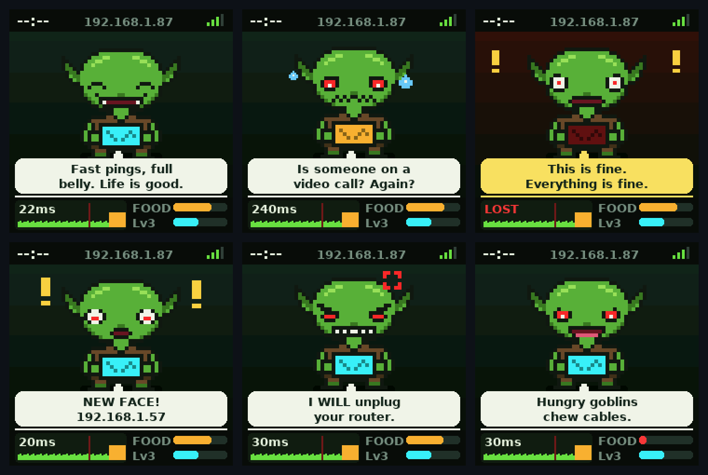

<p align="center"></p>

# Network Goblin DB-1: Desk Buddy

**Turn a super-cheap 1.54" ESP32-C2 "smart weather clock" cube into a network-watching desk goblin.**

The goblin lives on your desk and keeps an eye on your network. He's happy when your ping is fast, sweats when it's slow, panics when the internet drops, and shouts "NEW FACE!" when an unknown device joins your LAN. Feed him cookies, pat him (not too much, he bites), and he levels up from *Cable Chewer* to *Goblin King of the LAN*.

<p align="center"></p>

Part of the **Network Goblin** family of hacked-together network gadgets.

---

## Features

**Network mood**
- Pings the internet (default `1.1.1.1`) every 5 s and your router every 10 s
- Live ping graph on screen and on the web page
- The gadget the goblin holds glows **cyan** (good), **amber** (slow), **red** (internet down) or **purple** (no Wi-Fi)
- Outage log with start time and duration

**New-device alerts**
- ARP sweep of the local /24 every few minutes (configurable, or off)
- The first sweep becomes the baseline; anything new after that triggers a "NEW FACE!" alert
- Name and approve devices from the web page; flags randomized/private MACs

**Pet / XP**
- Hunger, happiness and XP with 14 levels and titles
- Feed him HTTP cookies from the web page
- Patting has a cooldown and an annoyance meter: happy → grumpy → angry → *CHOMP* → sulking
- Sleeps (and dims the screen) at night
- Dozens of mood-specific phrases filled with live values (ping, device count, SSID, router IP...)

**Quality of life**
- Wi-Fi setup hotspot (`Goblin-Setup-XXXX`) on first boot
- IP address always shown in the status bar
- Mobile-friendly web page for stats, devices, settings
- **Over-the-air updates** from the web page, so you only need USB once
- OTA rollback protection

---

## Hardware

The target is a generic 1.54" "Smart Weather Clock" desk cube sold under many names for a few dollars. You have the right one if the board has:

| | |
|---|---|
| MCU | **ESP8684H4** (= ESP32-C2), 4 MB embedded flash, **26 MHz crystal** |
| USB-serial | CH340C with auto-reset (no buttons needed to flash) |
| Display | 1.54" 240×240 **ST7789** on a 10-pin FPC |
| Board marking | `20251226 V1.3` (other revisions may differ) |
| Buttons | none |

Full pinout and how it was recovered: [docs/HARDWARE.md](docs/HARDWARE.md)

> Different board? Check the stock firmware's pin setup the same way (see HARDWARE.md) and change the defines in `main/lcd.h`.

---

## Flashing (no toolchain needed)

You need Python and esptool: `pip install esptool`

### 1. Back up the stock firmware first!
```
python -m esptool --chip esp32c2 -p COM5 -b 460800 read-flash 0 ALL stock_dump.bin
```
Keep this file private. It's the manufacturer's firmware and may contain your Wi-Fi password. To restore later:
```
python -m esptool --chip esp32c2 -p COM5 write-flash 0 stock_dump.bin
```

### 2. Flash the goblin
Windows: run `prebuilt/flash.bat`. Anywhere else:
```
cd prebuilt
python -m esptool --chip esp32c2 -p <PORT> -b 460800 write-flash \
  0x0 bootloader.bin 0x8000 partition-table.bin 0xf000 ota_data_initial.bin \
  0x20000 goblin_buddy_v0.1.3.bin
```

### 3. Set up Wi-Fi
1. After ~45 s without a known network, the goblin opens a hotspot called **`Goblin-Setup-XXXX`**
2. Join it with your phone and open **http://192.168.4.1**
3. Pick your network. The goblin shows his new IP in the top bar.

### 4. Future updates
Open the goblin's web page → **Firmware update & system** → upload the new `goblin_buddy_vX.Y.Z.bin`.

---

## Building from source

Needs **ESP-IDF v5.5.x**.

```
idf.py set-target esp32c2
idf.py build
idf.py -p <PORT> flash monitor
```

`sdkconfig.defaults` already sets the **26 MHz crystal** (`CONFIG_XTAL_FREQ_26`). Without it Wi-Fi and serial timing are wrong. The OTA partition table is in `partitions.csv`.

### Project layout
```
main/
  main.c      boot + housekeeping loop
  lcd.c/h     ST7789 driver (SPI, DMA double-buffered bands, backlight PWM)
  gfx.c/h     band renderer: rects, rounded rects, sprites, anti-aliased text
  ui.c        goblin scene, moods, animations, phrase book
  net.c       Wi-Fi, setup hotspot, ping monitor, outage tracking, SNTP
  scan.c      ARP sweep + device table
  pet.c       hunger / happiness / XP / patting + annoyance
  state.c/h   shared state, NVS persistence
  web.c       HTTP API + OTA
  web/        phone web page (index.html + gzipped copy that gets embedded)
  assets.h    GENERATED sprites + fonts
tools/gen_assets.py   pixel-art goblin, props and fonts -> assets.h (+ injects sprite into the web page)
sim/                  host-side screen simulator (render UI states to images, no hardware)
```

### Editing the goblin art or the web page
The goblin is ASCII pixel art in `tools/gen_assets.py`. After changing it (or `main/web/index.html`), regenerate:
```
pip install pillow
python tools/gen_assets.py
```
It uses DejaVu Sans Bold for the fonts (`fonts-dejavu` on Linux). The generated `main/assets.h` and `main/web/index.html.gz` are committed, so you only need this step if you change art, fonts or the page.

### Screen simulator
Test UI changes on your PC:
```
cd sim && ./build_sim.sh
```
It renders screens (happy, slow, offline, new device, angry...) to `.ppm` files and checks every phrase fits the speech bubble.

---

## Adding phrases
All phrases live near the top of `main/ui.c`, one list per mood. `|` splits the two bubble lines, and tokens like `{ping}`, `{dev}`, `{ip}`, `{ssid}`, `{gw}`, `{food}`, `{lvl}`, `{title}`, `{down}` are filled in live. Prefix a line with `@m` for mornings only or `@e` for evenings only. Run the simulator to check it fits. PRs with funny goblin lines are very welcome.

---

## Be a good goblin
The new-device feature sends ARP requests across the network the goblin is joined to. Only use it on networks you own or have permission to monitor. Set **LAN scan every** to `0` in Settings to turn it off.

## Changelog
- **v0.1.3**: IP always on screen, big phrase book per mood, device list streamed (fixes empty list with many devices)
- **v0.1.2**: Wi-Fi power save off, UI yields CPU to the web server, gzipped web page (fixes slow page / ping spikes)
- **v0.1.1**: Pat cooldown, annoyance meter, grumpy/angry faces, bite + sulk
- **v0.1.0**: First release

## License
MIT. See [LICENSE](LICENSE). Not affiliated with the maker of the original weather clock.
